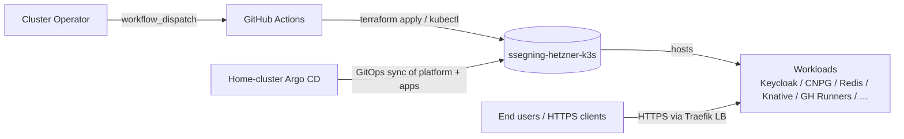
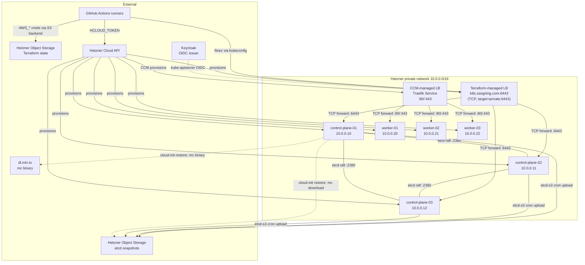

# 3. System Scope and Context

## 3.1 Business context

## 3.2 Technical context

## 3.3 External interfaces

| Direction | System                          | Protocol      | Purpose                                                    |
|-----------|---------------------------------|---------------|------------------------------------------------------------|
| in        | GH Actions → Hetzner Cloud API  | HTTPS REST    | Terraform provisions servers, LB, network, firewall, volumes |
| in        | GH Actions → cluster API LB     | HTTPS (mTLS)  | `/livez` gate, Platform Up `kubectl apply`                |
| in/out    | Home Argo CD ↔ cluster API LB   | HTTPS (mTLS)  | GitOps reconcile via `argocd-manager` ServiceAccount       |
| out       | cluster CPs → Hetzner Obj Stor  | HTTPS S3      | etcd snapshot upload via k3s etcd-s3 cron                  |
| in        | cp-1 cloud-init → Hetzner Obj S | HTTPS S3      | One-shot snapshot download during restore (via `mc`)       |
| in        | cp-1 cloud-init → dl.min.io     | HTTPS         | One-shot `mc` binary download during restore               |
| out       | kube-apiserver → Keycloak       | HTTPS OIDC    | Human auth                                                 |
| in        | end users → Traefik ingress LB  | HTTPS         | Workload traffic                                           |
