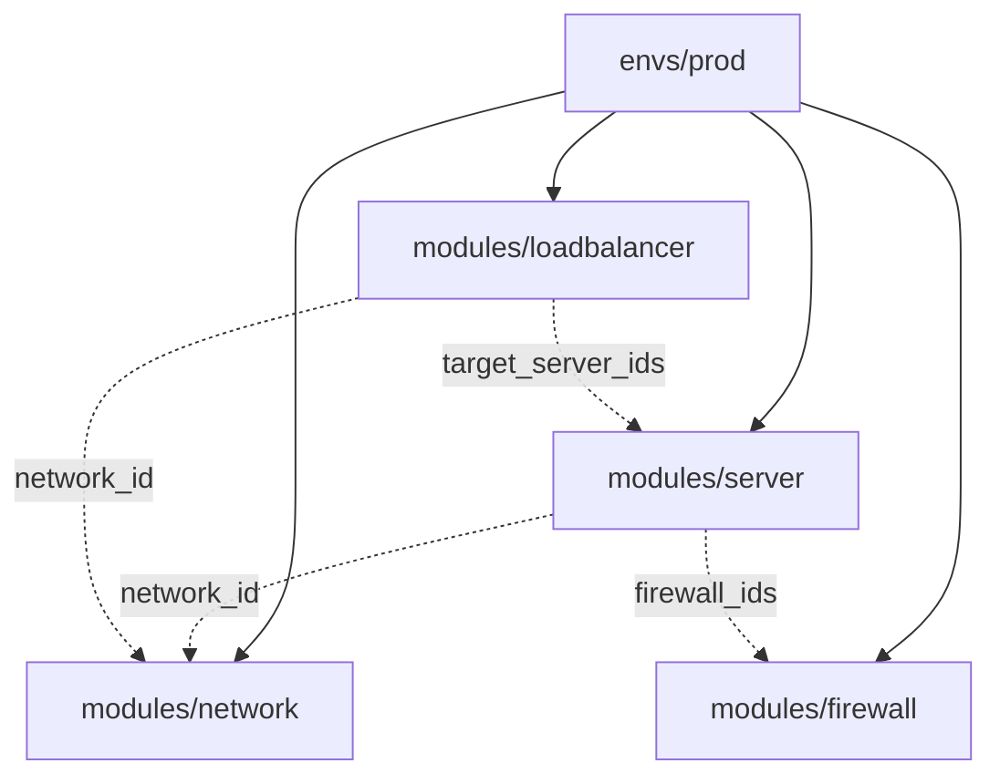
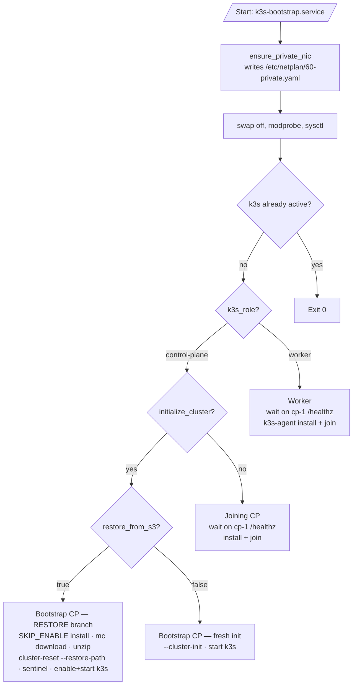

# 5. Building Block View

## 5.1 Repository layout

```
.
├── .github/workflows/        ← GH Actions: infra-up, infra-down, infra-destroy,
│                                platform-up, verify-etcd-backups
├── bootstrap/
│   ├── cloud-init/node.yaml  ← Single cloud-init template, role-conditional
│   └── scripts/              ← Local break-glass: bootstrap.sh, install-platform.sh
├── terraform/
│   ├── envs/prod/            ← Production environment composition
│   │   ├── main.tf           ← Wires modules
│   │   ├── locals.tf         ← Renders cloud-init per node
│   │   ├── vars.tf           ← Inputs
│   │   ├── outputs.tf        ← API endpoint, IPs, kubeconfig hints
│   │   └── providers.tf      ← hcloud + S3 backend
│   └── modules/
│       ├── network/          ← Private network + subnet
│       ├── firewall/         ← Firewall rules (no public ingress to nodes)
│       ├── server/           ← Hetzner servers + optional data volumes
│       └── loadbalancer/     ← Reusable LB module (used for API LB)
├── platform/                  ← In-cluster manifests + Helm values
│   ├── base/                  ← Namespaces, hcloud Secrets, NetworkPolicies, cluster-access
│   └── helm-values/           ← Cilium, CCM, CSI, Traefik values
├── workloads/                 ← Argo CD Application examples
├── tests/                     ← Render + unit tests
└── docs/                      ← arc42, ADRs, runbooks, lessons-learned
```

## 5.2 Terraform module map



| Module       | Resources                                                   | Notes                                            |
|--------------|-------------------------------------------------------------|--------------------------------------------------|
| network      | `hcloud_network`, `hcloud_network_subnet`                   | Private network `10.0.0.0/16`, single subnet     |
| firewall     | `hcloud_firewall`                                           | Inbound SSH 22, ICMP. No public 80/443/6443      |
| server       | `hcloud_server` per node, optional `hcloud_volume`          | for_each on `var.nodes`; embedded `network {}`   |
| loadbalancer | `hcloud_load_balancer`, service, targets, network attach    | Used for API LB on `:6443`                       |

The bootstrap CP key `control-plane-01` is special: its `user_data` has
`initialize_cluster=true`, which inside the cloud-init template selects
either the `--cluster-init` branch or the `--cluster-reset` (restore)
branch. All other CPs and workers wait on cp-1's `/healthz` then join.

## 5.3 Cloud-init: roles in one template

`bootstrap/cloud-init/node.yaml` is a single Terraform-templated file
rendered per-node. The same file produces all three role variants
(bootstrap CP, joining CP, worker) via `%{ if ... }%{ endif }` directives.

**Deployment model.** `user_data` is `ForceNew` on `hcloud_server`, but the
server resource sets `ignore_changes = [user_data]` (ADR-0013). So editing
this file does **not** retroactively change live nodes and does not show as
drift on a routine Infra Up. cloud-init only runs at first boot; a changed
template reaches a node only when that node is deliberately recreated with
`terraform apply -replace=<node>` (workers freely; control planes one at a
time to preserve etcd quorum; the restore flow `-replace`s the bootstrap CP
itself). Each node also gets a stable per-node password
(`random_password.node_password`) written to `/etc/rancher/node/password`
before k3s installs (ADR-0012).



## 5.4 GH Actions workflows

| Workflow                   | Trigger                                       | Purpose                                                                          |
|----------------------------|-----------------------------------------------|----------------------------------------------------------------------------------|
| `infra-up.yml`             | `workflow_dispatch`                           | Provision/refresh infra; optionally restore etcd from S3. Self-validates via `/livez` |
| `infra-down.yml`           | `workflow_dispatch`                           | Power off servers (preserves disks + state)                                      |
| `infra-destroy.yml`        | `workflow_dispatch` (guarded)                 | `terraform destroy`                                                              |
| `platform-up.yml`          | `workflow_dispatch`                           | Install/upgrade Cilium, CCM, CSI, Traefik, base manifests                        |
| `verify-etcd-backups.yml`  | `workflow_dispatch`                           | Confirm fresh S3 etcd snapshots exist                                            |

Each workflow uses Hetzner Object Storage as the Terraform S3 backend,
reads the same set of `TF_VAR_*` env variables, and writes summaries to
`GITHUB_STEP_SUMMARY` for triage.
