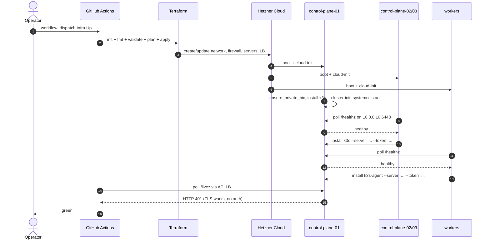
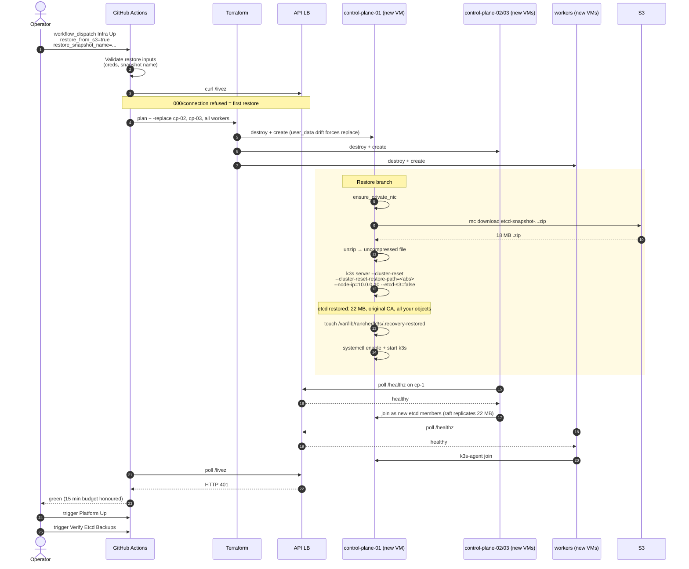
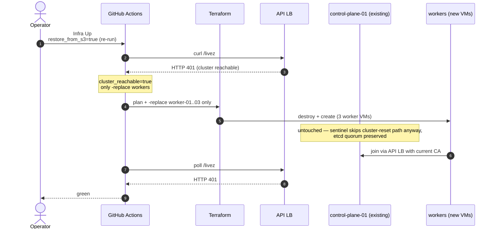
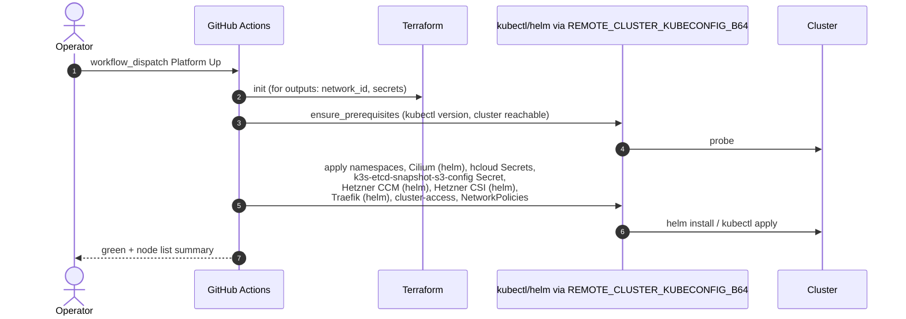
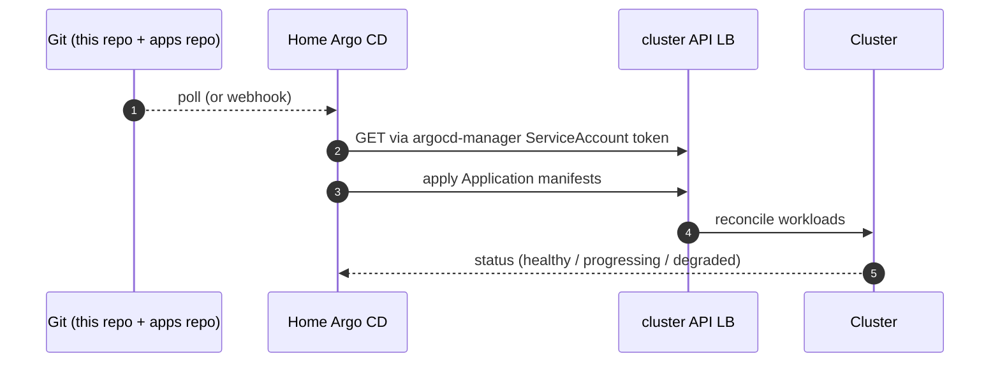

# 6. Runtime View

## 6.1 Routine Infra Up (no restore)

## 6.2 Restore from S3 — first run

## 6.3 Restore re-run against an already-restored cluster

## 6.4 Platform Up

## 6.5 Day-2 GitOps: home Argo CD reconciles

